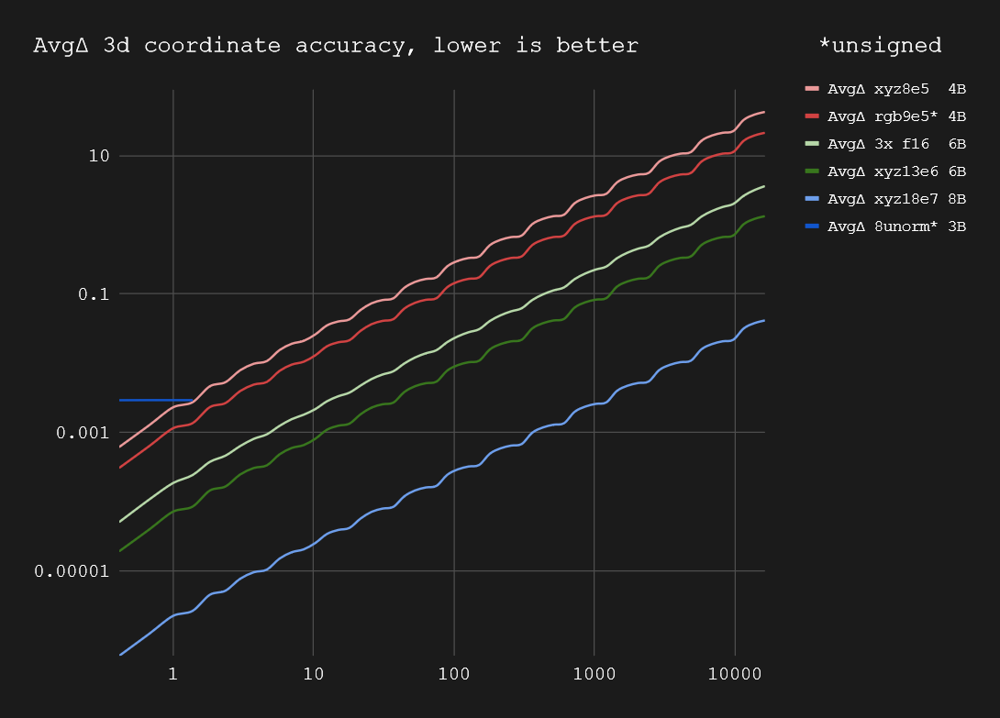

# Shared Exponent Formats

Implementations provided in rust, glsl, and wgsl.

## Overview
Using shared exponent formats can be beneficial for storing coordinates. When using three separate float values, precision can be wasted if one or two axes have significantly larger values than the other. This results in the smaller axis retaining higher precision, while the overall coordinate precision is limited by the largest value. A more efficient approach is to share the exponent across all three axes.

Another use case is storing colors values. By using a shared exponent format, it is possible to allocate the precision more effectively relative to the overall luminance. rgb9e5 is widely supported by gpus for things like HDR textures.

`xyz8e5` compared to `3x 8unorm`:
- One more byte
- Signed
- *Much* more range: max 6e4, epsilon 1e-7 (vs 1, 4e-3)
- Similar coordinate precision around 1.0
- Better coordinate precision below 1.0

`rgb9e5` compared to `3x 8unorm`:
- One more byte
- Matches common GPU texture format
- Better coordinate precision
- *Much* more range: Max 6e4, epsilon 6e-8 (vs 1, 4e-3)

`rgb13e6` compared to `3x f16`:
- Same size
- Better coordinate precision
- *Much* more range: Max 4e9, epsilon 6e-14 (vs 6e4, 1e-3)

`rgb18e7` compared to `3x f16`:
- One more byte
- Coordinate precision half way between f16 and f32
- ***Much*** more range: Max 1e19, epsilon 4e-25 (vs 6e4, 1e-3)

| Name      | Bytes | Signed | Max Val | Epsilon  |
|-----------|-------|--------|---------|----------|
| 3x 8unorm | 3     | false  | 1       | 3.92e-3  |
| xyz8e5    | 4     | true   | 65280   | 1.19e-7  |
| rgb9e5    | 4     | false  | 65408   | 5.96e-8  |
| 3x f16    | 6     | true   | 65504   | 9.77e-4  |
| xyz13e6   | 6     | true   | 4.29e9  | 5.68e-14 |
| xyz18e7   | 8     | true   | 1.84e19 | 4.14e-25 |

| Name      | 0.01 Max Δ | 0.1 Max Δ | 1.0 Max Δ | 10.0 Max Δ | 100 Max Δ | 1000 Max Δ |
|-----------|------------|-----------|-----------|------------|-----------|------------|
| 3x 8unorm | 3.39e-3    | 3.39e-3   | 3.39e-3   |            |           |            |
| rgb8e5    | 5.28e-5    | 4.23e-4   | 5.82e-3   | 5.40e-2    | 4.33e-1   | 3.46       |
| rgb9e5    | 2.64e-5    | 2.11e-4   | 2.91e-3   | 2.70e-2    | 2.16e-1   | 1.73       |
| 3x f16    | 6.58e-6    | 5.27e-5   | 4.22e-4   | 6.74e-3    | 5.39e-2   | 4.32e-1    |
| rgb13e6   | 1.65e-6    | 1.32e-5   | 1.82e-4   | 1.69e-3    | 1.36e-2   | 1.09e-1    |
| rgb18e7   | 5.01e-8    | 4.13e-7   | 5.65e-6   | 5.29e-5    | 4.23e-4   | 3.39e-3    |

Max Δ is max distance from f32 input 3d coordinate found. Tested with 1.0e8 random coordinates per range.

- All formats reproduce 0.0 and 1.0 exactly.
- INF becomes MAX for the respective format.
- NAN becomes 0.0. (rust impl only)
- rgb9e5 layout matches the common [GPU texture format](https://registry.khronos.org/OpenGL/extensions/EXT/EXT_texture_shared_exponent.txt)

X is input value random range. Y is distance from f32 input 3d coordinate:

Tested against f64:
